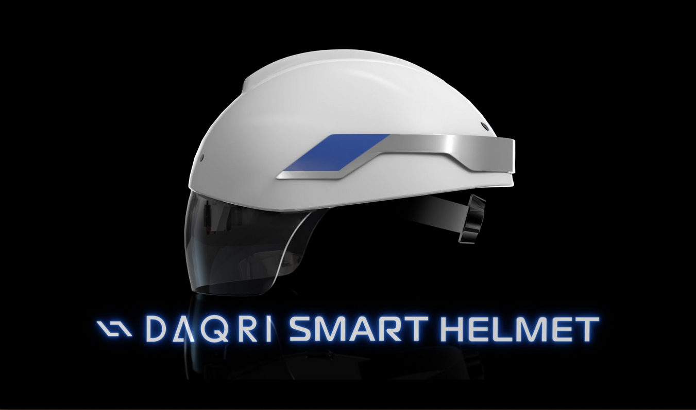
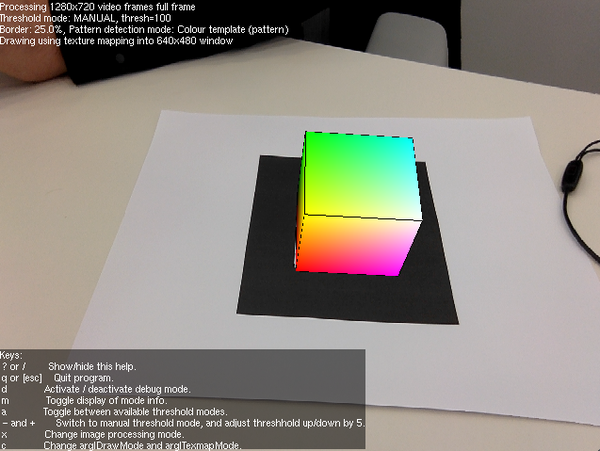
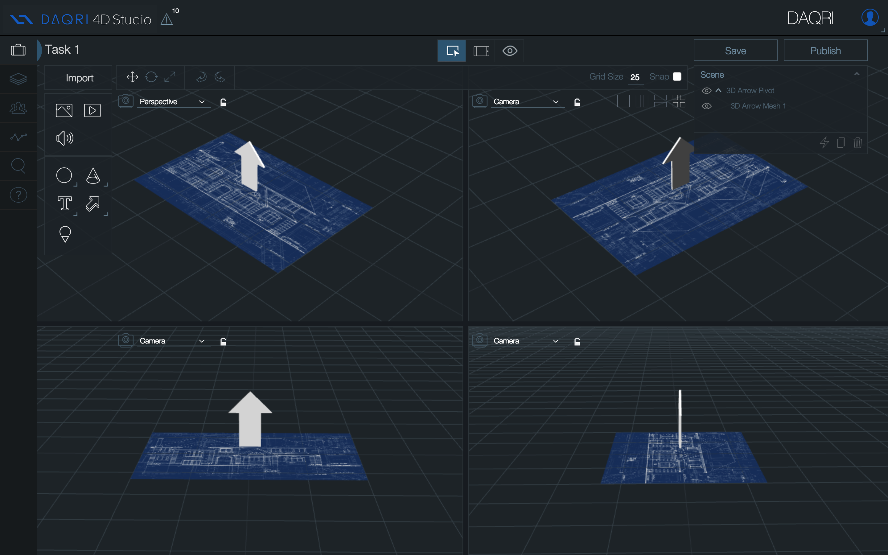
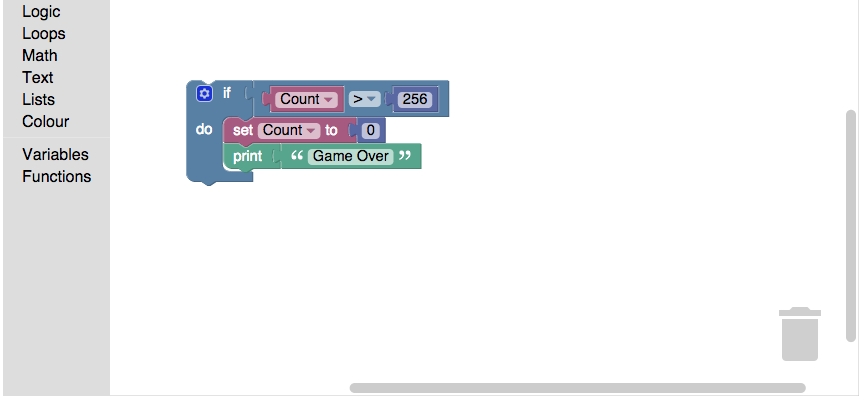

title: How we integrated a graphical language for AR
output: index.html
--

<style>section.slide-content img { width: 100% }</style>
<style>pre { font-size: 100% }</style>
<style>div.slide { background-image: url(images/daqri/daqri_ribbon.png); background-repeat: no-repeat; background-position: 0px 0px, top; }</style>


## Integrating a Graphical Language for Augmented Reality
## by [@jerome_etienne](https://twitter.com/jerome_etienne)

---

## An experiment to extend scripting to non-programmers

---

### Who Am I ?

- Lead for
Three.js Team at [Daqri](http://daqri.com) in Dublin
- Best Known as the author of [Learning Three.js Blog](http://learningthreejs.com/)
- Wrote more than [45 game extensions for three.js](http://www.threejsgames.com/extensions/)

Contact me Anytime on twitter [@jerome_etienne](https://twitter.com/jerome_etienne)

---

# What Is DAQRI ?

---

### Daqri By the Numbers


- Augmented Reality Startup - 200+ employees
- International Offices LA/Sunnyvale and Dublin
- 4+ Years old

---


# What Are We Doing ?

---

### Main Products - [Smart Helmet](http://hardware.daqri.com/smarthelmet/)



---

### Main Products - [Smart Helmet](http://hardware.daqri.com/smarthelmet/)

- Powerful Augmented Reality Device
- Wearable Helmet with 360 sensor package
- Actual hard hat for industrial purpose
- Precise 3D understanding of your work environment 

---


---

### Main Products - [AR Toolkit](http://artoolkit.org/)



---

### Main Products - [AR Toolkit](http://artoolkit.org/)

- Tracking library for augmented reality
- Run on desktop and mobile
- Acquired by Daqri in May 2015
- Had a free version + a pro version

**We opened source it all!**

---

### Main Products - [4D Studio](http://4dstudio.daqri.com)



---

### Main Products - [4D Studio](http://4dstudio.daqri.com)

- Authoring tool for Augmented Reality
- We build your AR scenario
- We play it on mobile and Smart Helmet 

---

# Scripting In 4D Studio

---

### What is Scripting 

- Allow to program each part of your AR scenario
- You choose how the user interact with your content
- Scripting provides a much richer experience

**Key concept to create interactive content**

---

### Scripting in 4D Studio

- Designed to be flexible and powerful
- Scripting available at every level
- Scripting for 3d world (similar to [three.js editor](http://threejs.org/editor))
- Scripting for screenspace UI

**META** add screenshots with examples

---

### How to Write Scripts

- Scripting for 3d uses [three.js](http://threejs.org)
- Screenspace UI uses web technology (css/html/js)
- All Done in javascript (most used language atm)
- Provides lots of flexibility and richness

**It Fits Perfectly the Power Users**

---

## What about other users ?

---

### Issues with Programming Languages

Heard in the field

- "What ? I missed a ( and all is broken ???"
- "What is the = vs == vs === ?"
- "Function and function are different ?!?"


---

### Issues with Programming Languages

- Javascript is hard to learn for non-programmers
- Very sensible to syntax and grammatical errors
- Normal Users are very uncomfortable - almost scared

**Learning how to code is time consuming**

---

# Graphical Languages To the Rescue

---

### Why Graphical Programming ?

- No more syntax or grammatical error
- Easier and faster to learn
- Less error prone. 

**Accessible to a Wider Range of Users**

---

# Blockly 

## A Nice Solution

---



---

### Why Blockly 
- Uses usual notions of sequential programming 
- So easier to learn and teach
- Easy to generate various languages e.g. javascript

---

### Blockly Origin

- Heavily Based on [scratch](scratch.mit.edu) by MIT
- Unfortunately scratch is in Flash
- Blockly is a scratch like in HTML5 by Google
- Used for [One Hour Of Code](https://hourofcode.com). nationwide effort in USA

---

### Flexible, Extensible, Documented
- It is [well documented](https://developers.google.com/blockly/)
- Lots of [examples to copy](https://blockly-demo.appspot.com/static/demos/index.html)
- You can code your own blocks in JS
- even in blockly itself, with its powerful [factory](https://blockly-demo.appspot.com/static/demos/blockfactory/index.html)

---

### Perfect To Experiment

- Able to generate scripts compatible with 4D Studio
- It can run on 4D Studio unmodified 


**Definitive for our experiment requirements**

---

# Integrating Blockly And 4D Studio
## Gory Details

---

### Blockly Editor As a Web App 
- Forked from [their examples](https://blockly-demo.appspot.com/static/demos/resizable/index.html)
- Run in its own window
- Developed independently from the main product

---

### Typical workflow


---

### Communication via Message Passing
- HTML5 allows to pass message between [window](https://developer.mozilla.org/en-US/docs/Web/API/Window/postMessage)
- 4D Studio and blockly Editor communication
- Clearly defined messages
- Small number of messages (only 3)

---

### Sending message to blockly editor

- Done via [postMessage](https://developer.mozilla.org/en-US/docs/Web/API/Window/postMessage) between window frames
- For example to change the content edited by blockly

```
editorWin.postMessage({
        type: 'loadContent',
        data: contentText
}, editorOrigin)
```

---

### Receiving message from blockly editor

Just listen to the ```message``` event 

```
window.addEventListener("message", function(event) {
	// check if it is for my domain
	if( event.source !== editorWin )	return

	var message	= event.data
        
        //... here process the message
})
```

---

### Storing file Format

- *Should* compatible with current 4D Studio
- *Should* store the javascript generated by blockly
- *Should* include the blockly layout

---

### Storing file Format


---

### Including Blockly Layout in JS
- Needed for users to retrieve blockly blocks where they created it
- Blockly store their code in XML

**We simply "Escaped" it in javascript comment**

---

### Escaped Blockly Layout in JS

```
// BLOCKLY XML START
// <xml xmlns="http://www.w3.org/1999/xhtml">
//   <block type="threejs_onUpdate" 
//          id="6" x="11" y="11">
//   </block>
// </xml>
// BLOCKLY XML END
```

---

# Conclusion

---

### Results

- We got basic blockly integrated in 4D Studio
- Little to no modification in 4D Studio

*Nicely loosely decoupled*

*Perfect for experimenting*

---

### Evaluation

- Need Users test to see how they react
- Feedback loop to improve it
- Depending on results, make it to actual product

---

# Questions ?
